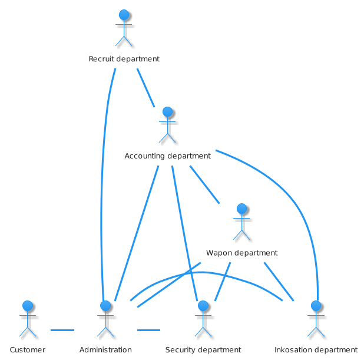
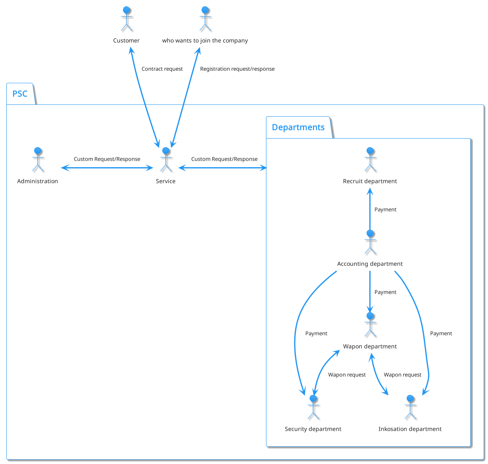
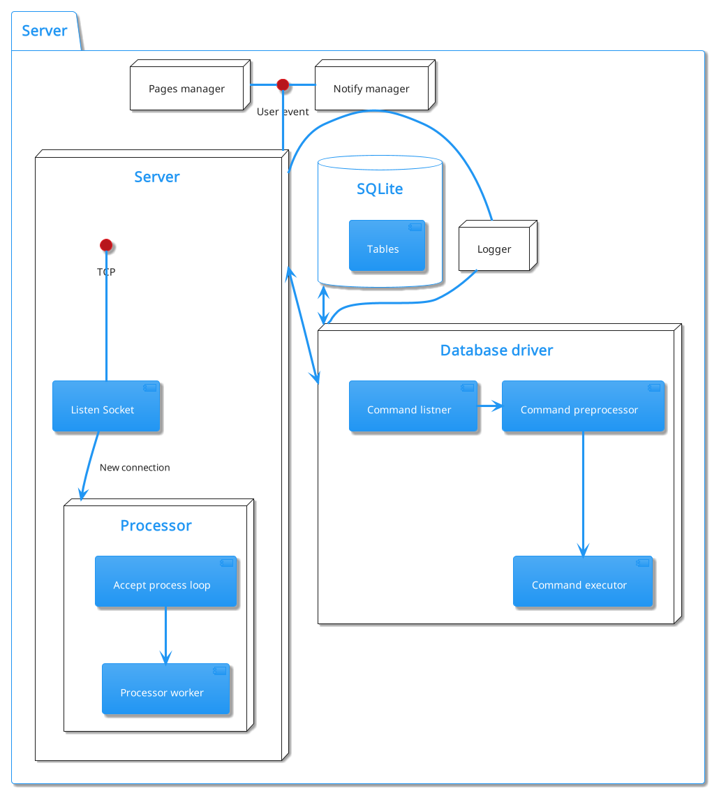

# Содержание
1. [ Введение ](#0069f25aafeaa88b5a5038c61e019a29)
2. [ Теоритическая часть ](#58423f3301dee86e5a6dd4564805721f)
       1. [ Организация ЧОП ](#a66c7beef7ee05ce09ccd305758a4b34)
       2. [ Информационные потоки ЧОП ](#644c422e8bfdc2ee8d075ef63b6ab7de)
       3. [ Процессы внутри ЧОП ](#bd328bb371cabcf61a023dd89284d430)
3. [ Описание средстд разработки ](#f61c3d8237771dae61110cd55542d40f)
       1. [ Утилиты для разработки баз данных ](#2211f9a30f64e3adc7a68fb612f8a384)
           1. [ SQLite v3.35.5 stable ](#15c7d3fb026a6b7191009b2aba592007)
           2. [ SQLiteBrowser v3.12.2 ](#d9107f160c4cbd3769c9deef66bb16b0)
           3. [ DBVisualizer v12.1.8 ](#c5cd767e2d7140d75b7479628ef2625d)
       2. [ Библиотеки ](#5f7ed236cf861ab160476bb878a8e29d)
           1. [ Qt v6.2.4 ](#3724285fc23f07a780bf1b90d1b08737)
       3. [ Системы сборки и компиляторы ](#c41121e7ff1f037c52c40f6800344b60)
           1. [ CMake v3.22.3 ](#d769a93d450808dd2699e4d277b38a96)
           2. [ Ninja c1.10.2 ](#072c9837bf4124a78e8d64761c791708)
           3. [ clang v13.0.1 ](#066437d5c1c42dc540ef7b8b089593f5)
       4. [ IDE ](#a9d5433c4ced0429602d686763b511c0)
           1. [ QtCreator v6.0.2 ](#791bce00c1a5112cb0a8e83f8ea43dfd)
           2. [ VIM v8.2 ](#be86898d7ac3847f7ca9aa4e09d807c7)
               1. [ Плагины ](#678d92de681d726153a189bfe47a6ffe)
       5. [ Разное ](#5336cc1e18a44fcbcdcaf76434a9dbc1)
           1. [ Plantuml v1.2021.16 ](#1260d8308ede6b806d35e4d84021378e)
           2. [ BASH v5.1.16 ](#a7809f369ead5a4aba1407bab398c327)
       6. [ Отладка ](#99db6cf9ec16fd66532911909e4ea007)
           1. [ Valgrind v3.18 ](#3ecb9ddef9a2dddb3a2a67100b188eb6)
       7. [ VCS ](#b7249081aeaa3bc1b21f5a8f16eeb88e)
           1. [ GIT v2.35.1 ](#be9c09aacbde6d23d67f89a3fca38c08)
4. [ Разработы базы данных ЧОП ](#eb1fa9a0c02763fe5749637a8d16ac3a)
       1. [ Таблицы ](#28439b214a63ddabf081fe52b79e17ad)
       2. [ Визуализация базы данных ](#851980d29e4e343f67c61f95cea40cfa)
5. [ Разработка архитектуры приложения ](#142c5c1c8f822ab1538b7817a180b7ab)
       1. [ Основа ](#721f411e2bde409ec1037acdea3d0f8c)
           1. [ Информационные потоки ЧОП с учетом сервера ](#29ab5dc5f90003f2ab99e9f7e97299ac)
       2. [ Обращение к базе данных ](#503aa110ff5e803702414f90c5c5ebd6)
           1. [ Система безопасности ](#32bde6e6debc82c0610a99d90127ac67)
               1. [ Система идентификации и авторизации ](#c6725059f1407364b5c9cae3833a0b92)
               2. [ Система команд ](#86fb03765331149de407516aaeb0b09d)
       3. [ Клиен-Сервер ](#2ee3341b6480f3fef26e52e6aa3642cd)
           1. [ Протокол ](#047d272a34a43782c51918621461b8f2)
           2. [ Клиент ](#6a255c9653f902d73d96ad1b4fcc0d4e)
           3. [ Сервер ](#5b8e943bc4beaee5458ad082d6f1b630)
       4. [ Модель создания GUI ](#bfd028419917154b7a8120e6afe90bb3)
6. [ Реализация приложения ](#ad12d5b6aeddf84d8c72205610cfaf39)
       1. [ Пользовательский интерфейс ](#86798bf223d43272c3136ba329fbf9b3)
           1. [ PagesManager ](#84643a8881036d8725be23faf5bfaccc)
           2. [ NotifyManager ](#2c70e6e799cd133b94067ebe0f920217)
7. [ Заключение ](#e1c1d994d00e4e7a44fcd5d029d3548d)
8. [ Список литиратуры ](#bc5e99ae74607750379b50c9e11d0695)

<a id="0069f25aafeaa88b5a5038c61e019a29"></a>
# Введение
В наше временя оборот информации в бизнес сфере огромен, отцифрованно практически всё. Большая часть информации передаётся по средствам компьютерных сетей, в частности глобальнай – Интернет.

Технология Интернет приспособленна для передачи любого вида закодированной информации, чем пользуется в преимуществе большая часть бизнес отраслей для получения своей прибыли. Но во время развития Интернет появилась такая ниша как Взломщики, люди посягающии на не санкционированное получения доступа к ресурсам подключенных к Интернет. Вследствии начали стремительно развиваться технологии Криптографии , которые существующие еще со времён древнего Рима, и других методов борьбы с Взломщиками и не только.

Взломищакам могут быть интересны любые ресурсы: журналы Бухгалтерии, системы управления предприятеим и т.д.

Подходя к теме о ведении бизнеса в сфере ЧОП многие подозрительные личности могут быть заинтересованн в получении запланированных маршрутов инкосации, адресса жительства сотрудников…
Для пресечения перечисленных выше махинаций можно полностью отказаться от ведения своей деятельности в Интернет. 

Если это не выход – тогда необходимо развертывание системы защиты, чем мы и займемся в пределах данной работы.
Также самым современным решением будет использование Blockchain – децентрализованный метод хранения данных, но данный вариант не будет рассматриваться, так как всё сильно усложняет и, скорее всего, по просту не приемлем.

Решение будет выполненно в несколько шагов:

1. Анализ структуры ЧОП.
2. Анализ проходимых процессов в ЧОП.
3. Описание средств разработки.
4. Составление базы данных ЧОП.
5. Разработка архитектуры приложения для взаимодействия с ЧОП.
6. Реализация архитектурных решений
7. Написание исходных кодов.
8. Тестирование.
 

<a id="58423f3301dee86e5a6dd4564805721f"></a>
# Теоритическая часть


<a id="a66c7beef7ee05ce09ccd305758a4b34"></a>
## Организация ЧОП
Охранное предприятие занимается охраной какой либо частной или государственной собственности.

ЧОП, чаще всего состоит из трех подразделений:

- Бухгалтерия
2. Дирекция(она же администрация)
3. Отдел кадров
4. Отдел охраны
5. Отдел инкосации
6. Отдел вооружения



Если говорить о предоствляемых услугах более конкретно, то ЧОП для потребителя предлогает:

- Охрана объекта
- Охрана ценных бумаг или металов(инкосация)


<a id="644c422e8bfdc2ee8d075ef63b6ab7de"></a>
## Информационные потоки ЧОП



<a id="bd328bb371cabcf61a023dd89284d430"></a>
## Процессы внутри ЧОП


<a id="f61c3d8237771dae61110cd55542d40f"></a>
# Описание средстд разработки
В данном разделе будут рассмотрены средства разработки, используемые мной при создании ПС для ЧОП.


<a id="2211f9a30f64e3adc7a68fb612f8a384"></a>
## Утилиты для разработки баз данных


<a id="15c7d3fb026a6b7191009b2aba592007"></a>
### SQLite v3.35.5 stable

SQLite — компактная встраиваемая СУБД. Исходный код библиотеки передан в общественное достояние.
Данная СУБД работает в безсерверной конфигурации. Если сравнивать с другими СУБД, то в равных условиях запись SQLite осуществляет медленее на 20-30% чем другие СУБД, но чтение превосходит другие на 40-50%. SQLite не имеет привелегий, только систему авторизации, но это и не нужно в моем проекте, об этом будет сказано позже.
> Примичание:
> *Библиотека SQLite не будет использована в чистом виде, а в составе Qt v6.2.4*

<a id="d9107f160c4cbd3769c9deef66bb16b0"></a>
### SQLiteBrowser v3.12.2
Удобный FOSS браузер баз данных SQLite, использованный для отладки.

<a id="c5cd767e2d7140d75b7479628ef2625d"></a>
### DBVisualizer v12.1.8
Проприетарная утилита для работы с разными СУБД, использован для генерации графа таблиц составленной базы данных ЧОП.


<a id="5f7ed236cf861ab160476bb878a8e29d"></a>
## Библиотеки


<a id="3724285fc23f07a780bf1b90d1b08737"></a>
### Qt v6.2.4

Qt - один из самых популярных и больших фреймворков c++ на рынке. Важная характеристика Qt - переносимость, т.к. я работаю на Linux.

<a id="c41121e7ff1f037c52c40f6800344b60"></a>
## Системы сборки и компиляторы


<a id="d769a93d450808dd2699e4d277b38a96"></a>
### CMake v3.22.3

Система сборки c++. Сборка проекта и передача более низкоуровневому средству.

<a id="072c9837bf4124a78e8d64761c791708"></a>
### Ninja c1.10.2
Еще одна система сборки, только уже более низкого уровня, чем CMake. Передача исходного кода на компиляцию.

<a id="066437d5c1c42dc540ef7b8b089593f5"></a>
### clang v13.0.1
Компилятор семейства C. Без коментариев.


<a id="a9d5433c4ced0429602d686763b511c0"></a>
## IDE


<a id="791bce00c1a5112cb0a8e83f8ea43dfd"></a>
### QtCreator v6.0.2

IDE от компинии The Qt Company, использованный только как средство отладки и создания скелетов форм пользовательского интерфейса.

<a id="be86898d7ac3847f7ca9aa4e09d807c7"></a>
### VIM v8.2

Моя любимая IDE, в своей основе так же прост как и каноничный "блокнот" в Windows, только с максимальной степенью кастомизации. Главное достоинство, по моему мнению, - это управление без использования мыши и возможность настройки управляющих комбинаций максимально удобно, что сокращает время на бесполезное перемещение рук по рабочему пространству.

<a id="678d92de681d726153a189bfe47a6ffe"></a>
#### Плагины
```vim
    Plug 'https://github.com/xolox/vim-misc'                   " auto load
    Plug 'https://github.com/xolox/vim-session'                " session manager
    Plug 'wakatime/vim-wakatime'                               " wakatime.com
    Plug 'SirVer/ultisnips'                                    " snippets
    Plug 'https://github.com/honza/vim-snippets'               " snippents files
    Plug 'https://github.com/pangloss/vim-javascript.git'      " javascript extension
    Plug 'vim-airline/vim-airline'                             " status line
    Plug 'vim-airline/vim-airline-themes'                      " themes
    Plug 'vim-scripts/AfterColors.vim'                         " themes
    Plug 'rafi/awesome-vim-colorschemes'                       " themes
    Plug 'sonph/onehalf', { 'rtp': 'vim' }                     " theme
    Plug 'https://github.com/sjl/badwolf'                      " theme
    Plug 'https://github.com/joshdick/onedark.vim'             " theme
    Plug 'https://github.com/plasticboy/vim-markdown'          " markdown format support
    Plug 'ryanoasis/vim-devicons'                              " icons support
    Plug 'https://github.com/Yggdroot/indentLine'
    Plug 'ycm-core/YouCompleteMe'                              " code completer
    Plug 'rdnetto/YCM-Generator', { 'branch': 'stable'}
    Plug 'tpope/vim-commentary'                                " commentary shortcuts
    Plug 'm-pilia/vim-pkgbuild'                                " archlinux AUR PKGBUILD files support
    Plug 'https://github.com/tpope/vim-surround'               " html-like tags handle utils
    Plug 'https://github.com/octol/vim-cpp-enhanced-highlight' " cpp syntax hilightinght
    Plug 'ctrlpvim/ctrlp.vim'                                  " file finder
    Plug 'preservim/nerdtree'                                  " dir tree dock
    Plug 'https://github.com/preservim/tagbar'
    Plug 'vim-scripts/bufkill.vim'                             " exit buffers without exiting vim
    Plug 'jreybert/vimagit'                                    " git support
    Plug 'https://github.com/ap/vim-css-color'                 " HEX-colors hilighting
    Plug 'https://github.com/matze/vim-move'                   " code moving
    Plug 'https://github.com/junegunn/vim-easy-align'          " fast text aligning
    Plug 'https://github.com/ervandew/supertab'
    Plug 'https://github.com/jiangmiao/auto-pairs'             " completing pairs
    Plug 'https://github.com/rhysd/vim-clang-format'           " auto formating
    Plug 'honza/vim-snippets'                                  " set of snippets
    Plug 'https://github.com/godlygeek/tabular'                " tab extender
    Plug 'https://github.com/junegunn/vim-easy-align'
    Plug 'https://github.com/fadein/vim-FIGlet'  " figlet
    Plug 'https://github.com/scrooloose/syntastic'
```


<a id="5336cc1e18a44fcbcdcaf76434a9dbc1"></a>
## Разное


<a id="1260d8308ede6b806d35e4d84021378e"></a>
### Plantuml v1.2021.16
Средство создания UML диаграм. Использовано для визуализации объектов и просецссов.

<a id="a7809f369ead5a4aba1407bab398c327"></a>
### BASH v5.1.16
Bourne Again Shell - интерпритатор, использован для автоматизации некотерых процессов.
> Примечание:
> Оглавления данной работы было автоматически сгенерерованно данным bash-скриптом:
```bash
cat "$1" > "$1".indexed

>index

i=(-1 1)
prevLen=0
while read -r line; do
    hash="$(md5sum <<< "$line" | cut -d ' ' -f 1)"
    printf "<a id=\"%s\"></a>\n%s\n" "$hash" "$line" > tmp
    sed "/$line/ {
        x
        r /home/xewii/Documents/TIT/ZXC/tmp
    }" "$1".indexed > "$1".indexed.tmp
    mv "$1".indexed.tmp "$1".indexed
    hdrLen=$(awk -F'#' '{print NF-1}' <<< "$line")
    hdrTxt=$(echo "${line//#/}")
    (( $hdrLen > 1 )) && for (( j=1; j<$hdrLen*4; j++ )); do printf ' '; done
    (( $prevLen < $hdrLen )) && i[$hdrLen]=1
    printf "%d.[%s](#%s)\n" ${i[$hdrLen]} "$hdrTxt" "$hash"
    prevLen=$hdrLen
    let i[$hdrLen]++
done <<< "$(grep --color=no -E "^#+" "$1")" > index

mv "$1".indexed tmp
printf "# Содержание\n" > "$1".indexed
cat index >> "$1".indexed
cat tmp >> "$1".indexed

rm tmp
rm index

```


<a id="99db6cf9ec16fd66532911909e4ea007"></a>
## Отладка


<a id="3ecb9ddef9a2dddb3a2a67100b188eb6"></a>
### Valgrind v3.18
Утилита профилирования и отладки программы, использовано в основном для обнаружения утечек памяти.

<a id="b7249081aeaa3bc1b21f5a8f16eeb88e"></a>
## VCS


<a id="be9c09aacbde6d23d67f89a3fca38c08"></a>
### GIT v2.35.1
GIT - система контроля версий, сомо о себе говрит. Использовался в основном для перенесения кода между машинами и как средство дистрибъюции.


<a id="eb1fa9a0c02763fe5749637a8d16ac3a"></a>
# Разработы базы данных ЧОП
База данных ЧОП в пределах данной работы - головная сущность, вокрук которой будет строится весь функционал.
База данных будет существовать под управлением SQLite.


<a id="28439b214a63ddabf081fe52b79e17ad"></a>
## Таблицы
В компанию, как известно, входит некоторое количество сотрудников, по этому, я создаю таблицу Users. Название выбрано таковым, потому что она будет содержать данные учетных записей сотрудников и клиентов ЧОП.
```sql
CREATE TABLE
    "Users"("id" INTEGER NOT NULL UNIQUE,
    	    "name" TEXT NOT NULL,
            "entryDate" TEXT NOT NULL,
            "role_id" INTEGER NOT NULL,
            "wapon_id" INTEGER,
            "email" TEXT UNIQUE,
            "login" TEXT NOT NULL UNIQUE,
            "password" BLOB NOT NULL UNIQUE,
            "salt" BLOB NOT NULL,
            "image" BLOB,
            FOREIGN KEY("wapon_id") REFERENCES "Wapons"("id")ON DELETE RESTRICT,
            FOREIGN KEY("role_id") REFERENCES "Roles"("id")ON DELETE RESTRICT,
            PRIMARY KEY("id" AUTOINCREMENT))
```
Таблица содержит данные для идентификации:

- login
- password
- salt

Пароль не храниться в открытов виде, а зашифорован с использованием динамической соли по алгоритму "Prefered salt algorithm", более подробно будет расмотрен далее.

Как видно, таблица Users зависит от таблиц Roles и Wapons, собственно вот они:
```sql
CREATE TABLE
	"Roles"("id" INTEGER NOT NULL UNIQUE,
		"name" TEXT NOT NULL UNIQUE,
                "commands_id" INTEGER NOT NULL,
                "payMultipler" DECIMAL(10, 3) NOT NULL,
                "payPeriod" INTEGER NOT NULL,
                FOREIGN KEY("commands_id") REFERENCES
                "roleCommands"("role_id")ON DELETE RESTRICT,
                PRIMARY KEY("id"))
```
Роль определяет какие данные и соответственно команды можешь выполнять на сервере. Ссылается на таблицу roleComands - это SQL массив с ID команд, которые может выполнять пользователь с данной ролью, по поэтому я и отказался от других, более тяжелых СУБД, т.к. все необходимые действия делегируются на Сервер, что будет рассмотрено далее, от СУБД требуется только хранить данные и извлекать их.
Связаная таблица roleCommands:
```sql
CREATE TABLE
    "roleCommands"("role_id" INTEGER NOT NULL,
                   "command_id" INTEGER NOT NULL,
                   FOREIGN KEY("role_id") REFERENCES
                   "Roles"("id")ON DELETE RESTRICT)
```
Таблица Wapons:
```sql
CREATE TABLE
	"Wapons"("id" INTEGER NOT NULL UNIQUE,
                 "employee_id" INTEGER UNIQUE,
                 "name" TEXT NOT NULL,
                 "ammo" INTEGER NOT NULL,
                 "price" DECIMAL(10, 3) NOT NULL,
                 "ammoPrice" DECIMAL(10, 3) NOT NULL,
                 "image" BLOB,
                 FOREIGN KEY("employee_id") REFERENCES
                 "Users"("id")ON DELETE RESTRICT,
                 PRIMARY KEY("id"))
```
Каждая запись в таблице Wapons - это еденица зарегестрированного оружия, в полной мере описывающяя необходимые характеристики для ЧОП.

Так как организация имеет свои расходы и доходы, нам нужно сохранять эти данные.
Таблица Accounting:
```sql
CREATE TABLE 
	"Accounting" ("id" INTEGER NOT NULL UNIQUE,
		      "accountingType_id" INTEGER NOT NULL,
		      "pay" DECIMAL(10, 3) NOT NULL,
		      "date" TEXT NOT NULL,
		      FOREIGN KEY("accountingType_id")
		      REFERENCES "AccountingType"("id") ON DELETE RESTRICT,
		      PRIMARY KEY("id") )
```
Зависит от таблицы AccountingType, описывающей какого рода транзакция была совершена.
```sql
CREATE TABLE
	"AccountingType" ("id" INTEGER NOT NULL UNIQUE,
    			  "name" TEXT NOT NULL UNIQUE,
    			  PRIMARY KEY("id","name") )
```

ЧОП получает доход от контрактов, по этому была составлена таблица Contracts:
```sql
CREATE TABLE
    "Contracts"("id" INTEGER NOT NULL UNIQUE,
                "assignedEmployees_id" INTEGER NOT NULL,
                "customer_id" INTEGER NOT NULL,
                "objectType_id" INTEGER NOT NULL,
                "objectAddress" TEXT NOT NULL,
                "objectWayPoint" TEXT, "date" TEXT NOT NULL,
                "expirationDate" TEXT NOT NULL,
                "weekends" TEXT NOT NULL,
                FOREIGN KEY("customer_id") REFERENCES
                "Users"("id")ON DELETE RESTRICT,
                PRIMARY KEY("id"),
                FOREIGN KEY("assignedEmployees_id") REFERENCES
                "AssignedEmployees"("employee_id") ON DELETE RESTRICT,
                FOREIGN KEY("objectType_id") REFERENCES
                "objectType"("id")ON DELETE RESTRICT)
```
Запись в таблице Contracts это сделка вида, описанного в связаной таблице objetType.
Таблица objetType:
```sql
CREATE TABLE
	"objectType" ( "id" INTEGER NOT NULL UNIQUE,
		       "name" TEXT NOT NULL UNIQUE,
    		       "price" DECIMAL(10, 3) NOT NULL,
    		       PRIMARY KEY("id") )
```
Запись в данной таблице описывает объект контракта, где указывается базавая цена за период оплаты(payPeriod) исполнителя/исполнителей контракта(assignedEmployees_id).
Для привязки нескольких сотрудников, была создана еще одна таблица AssignedEmployees, являющейся массивом.
```sql
CREATE TABLE "AssignedEmployees" (
    "id" INTEGER NOT NULL,
    "employee_id" INTEGER NOT NULL,
    "guiltyPercent" DECIMAL(10, 3) NOT NULL,
    "usedAmmo" INTEGER,
    FOREIGN KEY("employee_id") REFERENCES
    "Users"("id") ON DELETE RESTRICT,
    PRIMARY KEY("id") )
```
Для создания контракта в данной таблице нужно только 2 поля - id, employee_id.
Так так во время исполнения может произойти какой то ицедент, то была создана таблица Accidents:
```sql
CREATE TABLE
	"Accidents" ("id" INTEGER NOT NULL UNIQUE,
		     "name" TEXT NOT NULL,
    "contract_id"
    INTEGER NOT NULL,
    "usedAmmoCount" INTEGER,
    "damagePrice" DECIMAL(10, 3),
    "assignedEmployees_id" INTEGER,
    FOREIGN KEY("contract_id") REFERENCES "Contracts"("id") ON DELETE RESTRICT,
    FOREIGN KEY("assignedEmployees_id") REFERENCES "AssignedEmployees"("id") ON DELETE RESTRICT,
    PRIMARY KEY("id") )
```
Описывает проишествия, произошедшие во время исполнения контракта.
Если у нас есть контракты, описывающие некую деятельность с учетом выходных и рамок начала и окончания службы, то можно было бы ускорить вычисление рабочего времени по дням с помощью препроцессинга данных из записи Contracts. Таблицей, в которую сохраняются транслированные данные является - DutySchedule:
```sql
CREATE TABLE
	"DutySchedule" ( "emploee_id" INTEGER NOT NULL,
			 "day" INTEGER NOT NULL
			 FOREIGN KEY("emploee_id") REFERENCES "Users"("id") ON DELETE RESTRICT )
```
day - это 64х битная цыфра со знаком в формате UNIX time(secs since epoch). 


<a id="851980d29e4e343f67c61f95cea40cfa"></a>
## Визуализация базы данных


<a id="142c5c1c8f822ab1538b7817a180b7ab"></a>
# Разработка архитектуры приложения
Приложение для взаимодействия с моделью ЧОП, построенной ранее, должно предоставлять функционал для реализации всех описанных процессов взаимодействия с моделью ЧОП.


<a id="721f411e2bde409ec1037acdea3d0f8c"></a>
## Основа
Основной функцией приложения, как понятно из темы курсовой работы, будет обеспечение безопасности данных.
Исходя из этого в голову приходит идея организовать клиент-серверную архитектуру приложения, но это не главная причина почему выбрана такая архитектура. Основная причина - необходимость принимать заказы от клиентов, предоставить им функционал для удобного взаимодействия с персоналом ЧОП, но по большей части он будет взаимодействовать с клавиатурой.
И для персонала ЧОП тоже будет намного удобнее и быстрее использовать унифицированные методы итерации с базой данных и самой организацией.

## Информационные потоки ЧОП
<a id="644c422e8bfdc2ee8d075ef63b6ab7de"></a>
## Информационные потоки ЧОП
 


<a id="503aa110ff5e803702414f90c5c5ebd6"></a>
## Обращение к базе данных
Как было сказано ранее, СУБД не будет управлять системой привелегий, этим будет заниматься другой код. Система, которую я разработал основана на ролях, так же как и в обычных "умных" СУБД, к которым привязано некоторое количество возможных к исполнению команд.


<a id="32bde6e6debc82c0610a99d90127ac67"></a>
### Система безопасности
Для обеспечения более высокого уровня защиты команды и роли будут вшиты в программу. При каждом старте будет проверятся валидность первоначальных данных и имеющихся на данный момент в базе данных.
Также, как мера безопасности к ПС будут предложены хеш суммы исполняемых файлов. 

<a id="c6725059f1407364b5c9cae3833a0b92"></a>
#### Система идентификации и авторизации
При регистрации нового пользователя создается новая запись в таблице Users, все поля, короме поля password сохраняются в неизменнов виде. password сохраняется в захешированном виде при использовании хэш функции sha512 с использование динамической соли.

Алгоритм создания соли:

1. Подсчет количества символов разных типов в пароле.
2. Выявление слабых сторон пароля.
3. Формирование алфавита для создания соли.
4. С помощью "strog random" функции выборка символов из составленого алфавита.
5. Запись результата.

Алгоритм хэширования пароля:

1. Генерация соли.
2. Взятие первичного хеша с пароля.
3. Итерационно выбрать по байтно методом XOR младших битов первичного хеша и переданного пароля места вставки соли.
4. Хеширование получившейся строки.
5. Запись результата.

Данный алгорит и выбраная хэш функция ограничивают максимальную длину пароля до 64 символов.
Длина соли была вабрана 32 байтная.
Соль сохраняется вместе с паролем, чтобы обеспечить возможность идентификации.

Для идентификации проводится сравнивание значение пароля из базы данных с переданным в функцию шифрования с солью данной записи пользователя пароля. 


<a id="86fb03765331149de407516aaeb0b09d"></a>
#### Система команд
Проанализировав информационные потоки и требования ЧОП я составил 22 команды, в исходном коде объявление команд выглядит вот так:

```C
// id, name, executor
#define COMMANDS_MAP(XX) \
    XX( 0,  MAKE_CONTRACT,        exec_make_contract      ) \
    XX( 1,  MAKE_DUTY_SCHEDULE,   exec_make_duty_schedule ) \
    XX( 2,  REGISTER_ACCIDENT,    exec_register_accident  ) \
    XX( 3,  REGISTER_EMPLOYEE,    exec_register_employee  ) \
    XX( 4,  REGISTER_CUSTOMER,    exec_register_customer  ) \
    XX( 5,  REGISTER_OBJECT_TYPE, exec_register_object_type) \
    XX( 6,  REGISTER_WAPON,       exec_register_wapon     ) \
    XX( 7,  ASSIGN_WAPON,         exec_assign_wapon       ) \
    XX( 8,  PAY_AMMO,             exec_pay_ammo           ) \
    XX( 9,  PAY_EMPLOYEE,         exec_pay_employee       ) \
    XX( 10, PAY_ACCIDENT,         exec_pay_accident       ) \
    XX( 11, EDIT_OBJECT_TYPE,     exec_edit_object_type   ) \
    XX( 12, UPDATE_ROLE,          exec_update_role        ) \
    XX( 13, GET_USER_INFO,        exec_get_user_info      ) \
    XX( 14, GET_ACCIDENT_DETAILS, exec_get_accident_details) \
    XX( 15, GET_ACCOUNTING_ENTRY, exec_get_accounting_entry) \
    XX( 16, GET_OBJECT_DETAILS,   exec_get_object_detalils) \
    XX( 17, GET_ROLE_DETAILS,     exec_get_role_details   ) \
    XX( 18, GET_WAPON_DETAILS,    exec_get_wapon_details  ) \
    XX( 19, GET_DUTY_SCHEDULE,    exec_get_duty_schedule  ) \
    XX( 20, CREATE_TABLE,         exec_create_table       ) \
    XX( 21, IDENTIFY,             exec_identify           ) \

```


<a id="2ee3341b6480f3fef26e52e6aa3642cd"></a>
## Клиен-Сервер


<a id="047d272a34a43782c51918621461b8f2"></a>
### Протокол


<a id="6a255c9653f902d73d96ad1b4fcc0d4e"></a>
### Клиент


<a id="5b8e943bc4beaee5458ad082d6f1b630"></a>
### Сервер



<a id="bfd028419917154b7a8120e6afe90bb3"></a>
## Модель создания GUI


<a id="ad12d5b6aeddf84d8c72205610cfaf39"></a>
# Реализация приложения


<a id="86798bf223d43272c3136ba329fbf9b3"></a>
## Пользовательский интерфейс


<a id="84643a8881036d8725be23faf5bfaccc"></a>
### PagesManager


<a id="2c70e6e799cd133b94067ebe0f920217"></a>
### NotifyManager


<a id="e1c1d994d00e4e7a44fcd5d029d3548d"></a>
# Заключение
Вот и сказочки конец, кто дочитал - тот молодец.


<a id="bc5e99ae74607750379b50c9e11d0695"></a>
# Список литиратуры
1. https://wiki.qt.io - документация Qt
2. https://www.sqlite.org/ - документация SQLite

