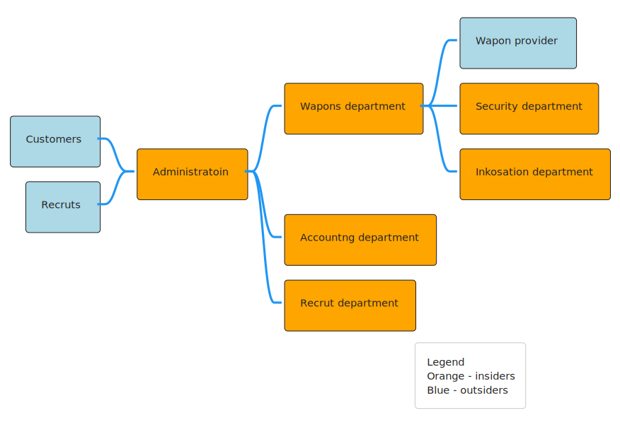
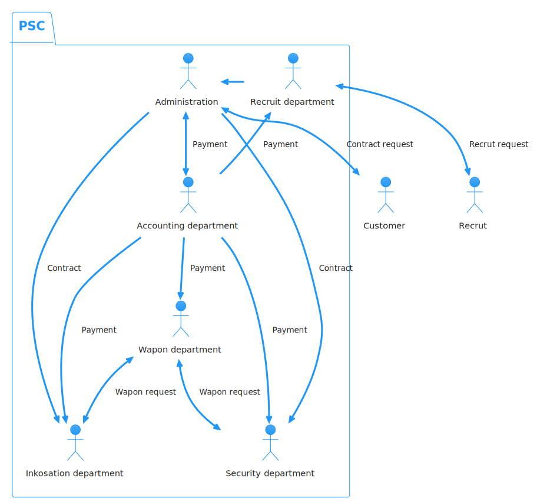
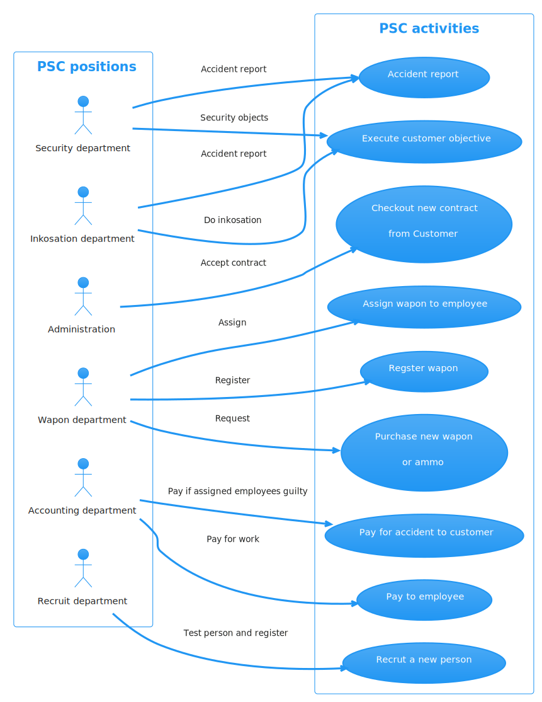
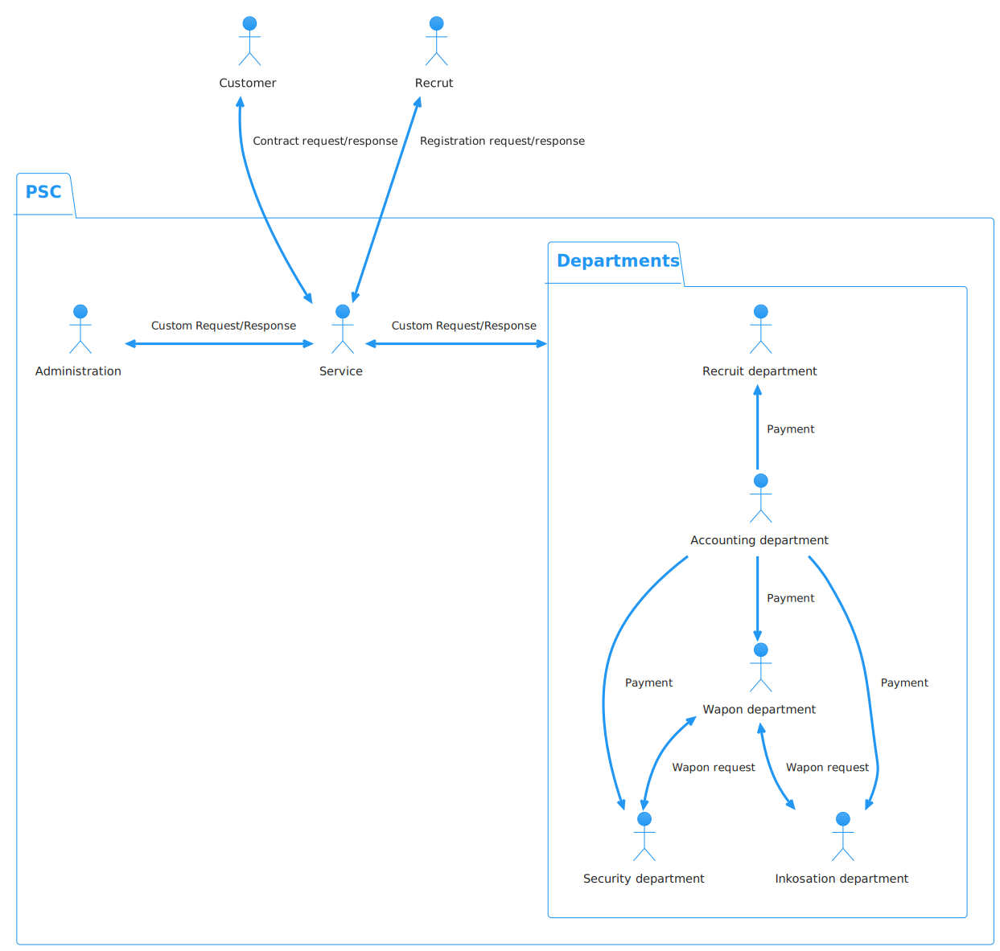
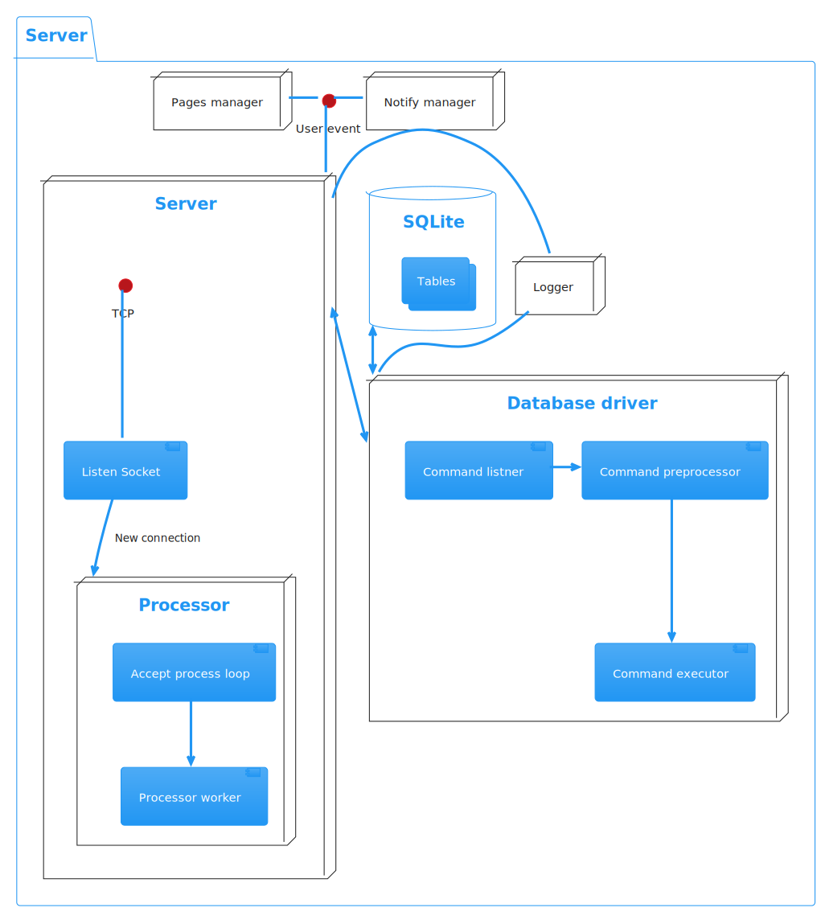

# Содержание
1. [ Введение ](#0069f25aafeaa88b5a5038c61e019a29)
2. [ Теоритическая часть ](#58423f3301dee86e5a6dd4564805721f)
	1. [ Организация ЧОП ](#a66c7beef7ee05ce09ccd305758a4b34)
	2. [ Информационные потоки ЧОП ](#644c422e8bfdc2ee8d075ef63b6ab7de)
	3. [ Процессы внутри ЧОП ](#bd328bb371cabcf61a023dd89284d430)
		1. [ Описание процессов ](#55bb6be8b93e93b450e602b5d88f0744)
			1. [ Составление контракта ](#a10e8e66a8fb12520c93c572664604c9)
			2. [ Прием на работу ](#492dbf93213f4fdd2414b9e35224c200)
			3. [ Регистрация и выдача оружия ](#a67dfdaec394ee405cbad740a91f9c25)
			4. [ Выплаты ](#17b28a30349fce25cd658d2188eff4f3)
3. [ Описание средстд разработки ](#f61c3d8237771dae61110cd55542d40f)
	1. [ Утилиты для разработки баз данных ](#2211f9a30f64e3adc7a68fb612f8a384)
		1. [ SQLite v3.35.5 stable ](#15c7d3fb026a6b7191009b2aba592007)
		2. [ SQLiteBrowser v3.12.2 ](#d9107f160c4cbd3769c9deef66bb16b0)
		3. [ DBVisualizer v12.1.8 ](#c5cd767e2d7140d75b7479628ef2625d)
	2. [ Библиотеки ](#5f7ed236cf861ab160476bb878a8e29d)
		1. [ Qt v6.2.4 ](#3724285fc23f07a780bf1b90d1b08737)
	3. [ Системы сборки и компиляторы ](#c41121e7ff1f037c52c40f6800344b60)
		1. [ CMake v3.22.3 ](#d769a93d450808dd2699e4d277b38a96)
		2. [ Ninja c1.10.2 ](#072c9837bf4124a78e8d64761c791708)
		3. [ clang v13.0.1 ](#066437d5c1c42dc540ef7b8b089593f5)
	4. [ IDE ](#a9d5433c4ced0429602d686763b511c0)
		1. [ QtCreator v6.0.2 ](#791bce00c1a5112cb0a8e83f8ea43dfd)
		2. [ VIM v8.2 ](#be86898d7ac3847f7ca9aa4e09d807c7)
			1. [ Плагины ](#678d92de681d726153a189bfe47a6ffe)
	5. [ Разное ](#5336cc1e18a44fcbcdcaf76434a9dbc1)
		1. [ Plantuml v1.2021.16 ](#1260d8308ede6b806d35e4d84021378e)
		2. [ BASH v5.1.16 ](#a7809f369ead5a4aba1407bab398c327)
	6. [ Отладка ](#99db6cf9ec16fd66532911909e4ea007)
		1. [ Valgrind v3.18 ](#3ecb9ddef9a2dddb3a2a67100b188eb6)
	7. [ VCS ](#b7249081aeaa3bc1b21f5a8f16eeb88e)
		1. [ GIT v2.35.1 ](#be9c09aacbde6d23d67f89a3fca38c08)
4. [ Разработы базы данных ЧОП ](#eb1fa9a0c02763fe5749637a8d16ac3a)
	1. [ Таблицы ](#28439b214a63ddabf081fe52b79e17ad)
	2. [ Визуализация базы данных ](#851980d29e4e343f67c61f95cea40cfa)
5. [ Разработка архитектуры приложения ](#142c5c1c8f822ab1538b7817a180b7ab)
	1. [ Основа ](#721f411e2bde409ec1037acdea3d0f8c)
		1. [ Информационные потоки ЧОП с учетом сервера ](#29ab5dc5f90003f2ab99e9f7e97299ac)
	2. [ Обращение к базе данных ](#503aa110ff5e803702414f90c5c5ebd6)
		1. [ Система безопасности ](#32bde6e6debc82c0610a99d90127ac67)
			1. [ Система идентификации и авторизации ](#c6725059f1407364b5c9cae3833a0b92)
			2. [ Система команд ](#86fb03765331149de407516aaeb0b09d)
	3. [ Архитектура Клиент-Сервер ](#7a8fc1fb6caba045510869990bcae157)
		1. [ Протокол ](#047d272a34a43782c51918621461b8f2)
			1. [ Формат сообщений ](#d601d1cdf1d51beb692dd2b3f43e5038)
		2. [ Модель сервера ](#c6c1ffce38a4e50926edc47be9e48348)
		3. [ Модель клиента ](#1485f36d1fb2c884ad1ab3d813451dd7)
6. [ Реализация ](#46fab2507eadf89755d4aea454bfe185)
	1. [ Пользовательский интерфейс ](#86798bf223d43272c3136ba329fbf9b3)
		1. [ PagesManager ](#84643a8881036d8725be23faf5bfaccc)
		2. [ NotifyManager ](#2c70e6e799cd133b94067ebe0f920217)
	2. [ Логгер ](#1273e0f44063343112756ce23b2d6f2b)
	3. [ iiNPack ](#1801c85ec3a13ae99bc3fe8a25db50fb)
	4. [ Сервер ](#1739f69cead8bb7ff41563dcc748a072)
		1. [ Драйвер базы данных ](#2a334021979df79f54f0a8f48367c12c)
			1. [ Криптография ](#99ed80269db632accc22cace769ff223)
		2. [ Мнеденжер подключений ](#6dcd2956f39ef3cf8ebe3f1a82ebf0fd)
			1. [ Менеджер сессий ](#4185393f06367e388df7cec7cdea2c9d)
			2. [ ClientLink ](#1f7f90d854564597157d657bc7c8968a)
			3. [ Процессор подключения ](#c152088a798c5969e467612ed2109532)
	5. [ Клиент ](#b99b6558c7cde67d398236bf888d33cb)
		1. [ Service ](#7eef63514ed827f85a480746eea9b025)
		2. [ Менеджер групп страниц ](#bb5ea4981f0e9a3be08addcddaef373b)
7. [ Заключение ](#e1c1d994d00e4e7a44fcd5d029d3548d)
8. [ Список литиратуры ](#bc5e99ae74607750379b50c9e11d0695)

<a id="0069f25aafeaa88b5a5038c61e019a29"/>

# Введение

В наше временя оборот информации в бизнес сфере огромен, отцифрованно практически всё. Большая часть информации передаётся по средствам компьютерных сетей, в частности глобальнай – Интернет.

Технология Интернет приспособленна для передачи любого вида закодированной информации, чем пользуется в преимуществе большая часть бизнес отраслей для получения своей прибыли. Но во время развития Интернет появилась такая ниша как Взломщики, люди посягающии на не санкционированное получения доступа к ресурсам подключенных к Интернет. Вследствии начали стремительно развиваться технологии Криптографии , которые существующие еще со времён древнего Рима, и других методов борьбы с Взломщиками и не только.

Взломищакам могут быть интересны любые ресурсы: журналы Бухгалтерии, системы управления предприятеим и т.д.

Подходя к теме о ведении бизнеса в сфере ЧОП многие подозрительные личности могут быть заинтересованн в получении запланированных маршрутов инкосации, адресса жительства сотрудников…
Для пресечения перечисленных выше махинаций можно полностью отказаться от ведения своей деятельности в Интернет. 

Если это не выход – тогда необходимо развертывание системы защиты, чем мы и займемся в пределах данной работы.
Также самым современным решением будет использование Blockchain – децентрализованный метод хранения данных, но данный вариант не будет рассматриваться, так как всё сильно усложняет и, скорее всего, по просту не приемлем.

Решение будет выполненно в несколько шагов:

1. Анализ структуры ЧОП.
2. Анализ проходимых процессов в ЧОП.
3. Описание средств разработки.
4. Составление базы данных ЧОП.
5. Разработка архитектуры приложения для взаимодействия с ЧОП.
6. Реализация архитектурных решений
7. Тестирование.


<a id="58423f3301dee86e5a6dd4564805721f"/>

# Теоритическая часть


<a id="a66c7beef7ee05ce09ccd305758a4b34"/>

## Организация ЧОП

Охранное предприятие занимается охраной какой либо частной или государственной собственности.

ЧОП, чаще всего состоит из трех подразделений:

- Бухгалтерия
- Дирекция(она же администрация)
- Отдел кадров
- Отдел охраны
- Отдел инкосации
- Отдел вооружения

Если говорить о предоствляемых услугах более конкретно, то ЧОП для потребителя предлогает:

- Охрана объекта
- Охрана ценных бумаг или металов(инкосация)




<a id="644c422e8bfdc2ee8d075ef63b6ab7de"/>

## Информационные потоки ЧОП




<a id="bd328bb371cabcf61a023dd89284d430"/>

## Процессы внутри ЧОП




<a id="55bb6be8b93e93b450e602b5d88f0744"/>

### Описание процессов


<a id="a10e8e66a8fb12520c93c572664604c9"/>

#### Составление контракта


<a id="492dbf93213f4fdd2414b9e35224c200"/>

#### Прием на работу


<a id="a67dfdaec394ee405cbad740a91f9c25"/>

#### Регистрация и выдача оружия


<a id="17b28a30349fce25cd658d2188eff4f3"/>

#### Выплаты


Выплаты работникам:

Выплаты за нанесенный ущерб объекту охраны при не нулевом проценте вины сотрудника:


<a id="f61c3d8237771dae61110cd55542d40f"/>

# Описание средстд разработки

В данном разделе будут рассмотрены средства разработки, используемые мной при создании ПС для ЧОП.


<a id="2211f9a30f64e3adc7a68fb612f8a384"/>

## Утилиты для разработки баз данных


<a id="15c7d3fb026a6b7191009b2aba592007"/>

### SQLite v3.35.5 stable


SQLite — компактная встраиваемая СУБД. Исходный код библиотеки передан в общественное достояние.
Данная СУБД работает в безсерверной конфигурации. Если сравнивать с другими СУБД, то в равных условиях запись SQLite осуществляет медленее на 20-30% чем другие СУБД, но чтение превосходит другие на 40-50%. SQLite не имеет привелегий, только систему авторизации, но это и не нужно в моем проекте, об этом будет сказано позже.
> Примичание:
> *Библиотека SQLite не будет использована в чистом виде, а в составе Qt v6.2.4*

<a id="d9107f160c4cbd3769c9deef66bb16b0"/>

### SQLiteBrowser v3.12.2


Удобный FOSS браузер баз данных SQLite, использованный для отладки.

<a id="c5cd767e2d7140d75b7479628ef2625d"/>

### DBVisualizer v12.1.8


Проприетарная утилита для работы с разными СУБД, использован для генерации графа таблиц составленной базы данных ЧОП.


<a id="5f7ed236cf861ab160476bb878a8e29d"/>

## Библиотеки


<a id="3724285fc23f07a780bf1b90d1b08737"/>

### Qt v6.2.4


Qt - один из самых популярных и больших фреймворков c++ на рынке. Важная характеристика Qt - переносимость, т.к. я работаю на Linux.

<a id="c41121e7ff1f037c52c40f6800344b60"/>

## Системы сборки и компиляторы


<a id="d769a93d450808dd2699e4d277b38a96"/>

### CMake v3.22.3


Система сборки c++. Сборка проекта и передача более низкоуровневому средству.

<a id="072c9837bf4124a78e8d64761c791708"/>

### Ninja c1.10.2

Еще одна система сборки, только уже более низкого уровня, чем CMake. Передача исходного кода на компиляцию.

<a id="066437d5c1c42dc540ef7b8b089593f5"/>

### clang v13.0.1

Компилятор семейства C. Без коментариев.


<a id="a9d5433c4ced0429602d686763b511c0"/>

## IDE


<a id="791bce00c1a5112cb0a8e83f8ea43dfd"/>

### QtCreator v6.0.2


IDE от компинии The Qt Company, использованный только как средство отладки и создания скелетов форм пользовательского интерфейса.

<a id="be86898d7ac3847f7ca9aa4e09d807c7"/>

### VIM v8.2


Моя любимая IDE, в своей основе так же прост как и каноничный "блокнот" в Windows, только с максимальной степенью кастомизации. Главное достоинство, по моему мнению, - это управление без использования мыши и возможность настройки управляющих комбинаций максимально удобно, что сокращает время на бесполезное перемещение рук по рабочему пространству.

<a id="678d92de681d726153a189bfe47a6ffe"/>

#### Плагины

```vim
    Plug 'https://github.com/xolox/vim-misc'                   " auto load
    Plug 'https://github.com/xolox/vim-session'                " session manager
    Plug 'wakatime/vim-wakatime'                               " wakatime.com
    Plug 'SirVer/ultisnips'                                    " snippets
    Plug 'https://github.com/honza/vim-snippets'               " snippents files
    Plug 'https://github.com/pangloss/vim-javascript.git'      " javascript extension
    Plug 'vim-airline/vim-airline'                             " status line
    Plug 'vim-airline/vim-airline-themes'                      " themes
    Plug 'vim-scripts/AfterColors.vim'                         " themes
    Plug 'rafi/awesome-vim-colorschemes'                       " themes
    Plug 'sonph/onehalf', { 'rtp': 'vim' }                     " theme
    Plug 'https://github.com/sjl/badwolf'                      " theme
    Plug 'https://github.com/joshdick/onedark.vim'             " theme
    Plug 'https://github.com/plasticboy/vim-markdown'          " markdown format support
    Plug 'ryanoasis/vim-devicons'                              " icons support
    Plug 'https://github.com/Yggdroot/indentLine'
    Plug 'ycm-core/YouCompleteMe'                              " code completer
    Plug 'rdnetto/YCM-Generator', { 'branch': 'stable'}
    Plug 'tpope/vim-commentary'                                " commentary shortcuts
    Plug 'm-pilia/vim-pkgbuild'                                " archlinux AUR PKGBUILD files support
    Plug 'https://github.com/tpope/vim-surround'               " html-like tags handle utils
    Plug 'https://github.com/octol/vim-cpp-enhanced-highlight' " cpp syntax hilightinght
    Plug 'ctrlpvim/ctrlp.vim'                                  " file finder
    Plug 'preservim/nerdtree'                                  " dir tree dock
    Plug 'https://github.com/preservim/tagbar'
    Plug 'vim-scripts/bufkill.vim'                             " exit buffers without exiting vim
    Plug 'jreybert/vimagit'                                    " git support
    Plug 'https://github.com/ap/vim-css-color'                 " HEX-colors hilighting
    Plug 'https://github.com/matze/vim-move'                   " code moving
    Plug 'https://github.com/junegunn/vim-easy-align'          " fast text aligning
    Plug 'https://github.com/ervandew/supertab'
    Plug 'https://github.com/jiangmiao/auto-pairs'             " completing pairs
    Plug 'https://github.com/rhysd/vim-clang-format'           " auto formating
    Plug 'honza/vim-snippets'                                  " set of snippets
    Plug 'https://github.com/godlygeek/tabular'                " tab extender
    Plug 'https://github.com/junegunn/vim-easy-align'
    Plug 'https://github.com/fadein/vim-FIGlet'  " figlet
    Plug 'https://github.com/scrooloose/syntastic'
```


<a id="5336cc1e18a44fcbcdcaf76434a9dbc1"/>

## Разное


<a id="1260d8308ede6b806d35e4d84021378e"/>

### Plantuml v1.2021.16


Средство создания UML диаграм. Использовано для визуализации объектов и просецссов.

<a id="a7809f369ead5a4aba1407bab398c327"/>

### BASH v5.1.16


Bourne Again Shell - интерпритатор, использован для автоматизации некотерых процессов.
> Примечание:
> Оглавления данной работы было автоматически сгенерерованно данным bash-скриптом:
```bash
cat "$1" > "$1".indexed

>index

i=(-1 1)
prevLen=0
while read -r line; do
    hash="$(md5sum <<< "$line" | cut -d ' ' -f 1)"
    printf "<a id=\"%s\"></a>\n%s\n" "$hash" "$line" > tmp
    sed "/$line/ {
        x
        r /home/xewii/Documents/TIT/ZXC/tmp
    }" "$1".indexed > "$1".indexed.tmp
    mv "$1".indexed.tmp "$1".indexed
    hdrLen=$(awk -F'#' '{print NF-1}' <<< "$line")
    hdrTxt=$(echo "${line//#/}")
    (( $hdrLen > 1 )) && for (( j=1; j<$hdrLen*4; j++ )); do printf ' '; done
    (( $prevLen < $hdrLen )) && i[$hdrLen]=1
    printf "%d.[%s](#%s)\n" ${i[$hdrLen]} "$hdrTxt" "$hash"
    prevLen=$hdrLen
    let i[$hdrLen]++
done <<< "$(grep --color=no -E "^#+" "$1")" > index

mv "$1".indexed tmp
printf "# Содержание\n" > "$1".indexed
cat index >> "$1".indexed
cat tmp >> "$1".indexed

rm tmp
rm index

```


<a id="99db6cf9ec16fd66532911909e4ea007"/>

## Отладка


<a id="3ecb9ddef9a2dddb3a2a67100b188eb6"/>

### Valgrind v3.18

Утилита профилирования и отладки программы, использовано в основном для обнаружения утечек памяти.

<a id="b7249081aeaa3bc1b21f5a8f16eeb88e"/>

## VCS


<a id="be9c09aacbde6d23d67f89a3fca38c08"/>

### GIT v2.35.1

GIT - система контроля версий, сомо о себе говрит. Использовался в основном для перенесения кода между машинами и как средство дистрибъюции.


<a id="eb1fa9a0c02763fe5749637a8d16ac3a"/>

# Разработы базы данных ЧОП

База данных ЧОП в пределах данной работы - головная сущность, вокрук которой будет строится весь функционал.
База данных будет существовать под управлением SQLite.


<a id="28439b214a63ddabf081fe52b79e17ad"/>

## Таблицы

В компанию, как известно, входит некоторое количество сотрудников, по этому, я создаю таблицу Users. Название выбрано таковым, потому что она будет содержать данные учетных записей сотрудников и клиентов ЧОП.
```sql
CREATE TABLE
    "Users"("id" INTEGER NOT NULL UNIQUE,
            "name" TEXT NOT NULL,
            "entryDate" TEXT NOT NULL,
            "role_id" INTEGER NOT NULL,
            "wapon_id" INTEGER,
            "email" TEXT UNIQUE,
            "login" TEXT NOT NULL UNIQUE,
            "password" BLOB NOT NULL UNIQUE,
            "salt" BLOB NOT NULL,
            "image" BLOB,
            FOREIGN KEY("wapon_id") REFERENCES "Wapons"("id")ON DELETE RESTRICT,
            FOREIGN KEY("role_id") REFERENCES "Roles"("id")ON DELETE RESTRICT,
            PRIMARY KEY("id" AUTOINCREMENT))
```
Таблица содержит данные для идентификации:

- login
- password
- salt

Пароль не храниться в открытов виде, а зашифорован с использованием динамической соли по алгоритму "Prefered salt algorithm", более подробно будет расмотрен далее.

Как видно, таблица Users зависит от таблиц Roles и Wapons, собственно вот они:
```sql
CREATE TABLE
    "Roles"("id" INTEGER NOT NULL UNIQUE,
            "name" TEXT NOT NULL UNIQUE,
            "commands_id" INTEGER NOT NULL,
            "payMultipler" DECIMAL(10, 3) NOT NULL,
            "payPeriod" INTEGER NOT NULL,
            FOREIGN KEY("commands_id") REFERENCES
            "roleCommands"("role_id")ON DELETE RESTRICT,
            PRIMARY KEY("id"))
```
Роль определяет какие данные и соответственно команды можешь выполнять на сервере. Ссылается на таблицу roleComands - это SQL массив с ID команд, которые может выполнять пользователь с данной ролью, по поэтому я и отказался от других, более тяжелых СУБД, т.к. все необходимые действия делегируются на Сервер, что будет рассмотрено далее, от СУБД требуется только хранить данные и извлекать их.
Связаная таблица roleCommands:
```sql
CREATE TABLE
    "roleCommands"("role_id" INTEGER NOT NULL,
                   "command_id" INTEGER NOT NULL,
                   FOREIGN KEY("role_id") REFERENCES
                   "Roles"("id")ON DELETE RESTRICT)
```
Таблица Wapons:
```sql
CREATE TABLE
    "Wapons"("id" INTEGER NOT NULL UNIQUE,
             "employee_id" INTEGER UNIQUE,
             "name" TEXT NOT NULL,
             "ammo" INTEGER NOT NULL,
             "price" DECIMAL(10, 3) NOT NULL,
             "ammoPrice" DECIMAL(10, 3) NOT NULL,
             "image" BLOB,
             FOREIGN KEY("employee_id") REFERENCES
             "Users"("id")ON DELETE RESTRICT,
             PRIMARY KEY("id"))
```
Каждая запись в таблице Wapons - это еденица зарегестрированного оружия, в полной мере описывающяя необходимые характеристики для ЧОП.

Так как организация имеет свои расходы и доходы, нам нужно сохранять эти данные.
Таблица Accounting:
```sql
CREATE TABLE
    "Accounting" ("id" INTEGER NOT NULL UNIQUE,
                  "accountingType_id" INTEGER NOT NULL,
                  "pay" DECIMAL(10, 3) NOT NULL,
                  "date" TEXT NOT NULL,
                  FOREIGN KEY("accountingType_id")
                  REFERENCES "AccountingType"("id") ON DELETE RESTRICT,
                  PRIMARY KEY("id") )
```
Зависит от таблицы AccountingType, описывающей какого рода транзакция была совершена.
```sql
CREATE TABLE
    "AccountingType" ("id" INTEGER NOT NULL UNIQUE,
                      "name" TEXT NOT NULL UNIQUE,
                      PRIMARY KEY("id","name") )
```

ЧОП получает доход от контрактов, по этому была составлена таблица Contracts:
```sql
CREATE TABLE
    "Contracts"("id" INTEGER NOT NULL UNIQUE,
                "assignedEmployees_id" INTEGER NOT NULL,
                "customer_id" INTEGER NOT NULL,
                "objectType_id" INTEGER NOT NULL,
                "objectAddress" TEXT NOT NULL,
                "objectWayPoint" TEXT, "date" TEXT NOT NULL,
                "expirationDate" TEXT NOT NULL,
                "weekends" TEXT NOT NULL,
                FOREIGN KEY("customer_id") REFERENCES
                "Users"("id")ON DELETE RESTRICT,
                PRIMARY KEY("id"),
                FOREIGN KEY("assignedEmployees_id") REFERENCES
                "AssignedEmployees"("employee_id") ON DELETE RESTRICT,
                FOREIGN KEY("objectType_id") REFERENCES
                "objectType"("id")ON DELETE RESTRICT)
```
Запись в таблице Contracts это сделка вида, описанного в связаной таблице objetType.
Таблица objetType:
```sql
CREATE TABLE
    "objectType" ( "id" INTEGER NOT NULL UNIQUE,
                   "name" TEXT NOT NULL UNIQUE,
                   "price" DECIMAL(10, 3) NOT NULL,
                   PRIMARY KEY("id") )
```
Запись в данной таблице описывает объект контракта, где указывается базавая цена за период оплаты(payPeriod) исполнителя/исполнителей контракта(assignedEmployees_id).
Для привязки нескольких сотрудников, была создана еще одна таблица AssignedEmployees, являющейся массивом.
```sql
CREATE TABLE
    "AssignedEmployees" ( "id" INTEGER NOT NULL,
                          "employee_id" INTEGER NOT NULL,
                          "guiltyPercent" DECIMAL(10, 3) NOT NULL,
                          "usedAmmo" INTEGER,
                          FOREIGN KEY("employee_id") REFERENCES
                          "Users"("id") ON DELETE RESTRICT,
                          PRIMARY KEY("id") )
```
Для создания контракта в данной таблице нужно только 2 поля - id, employee_id.
Так так во время исполнения может произойти какой то ицедент, то была создана таблица Accidents:
```sql
CREATE TABLE
    "Accidents" ("id" INTEGER NOT NULL UNIQUE,
                 "name" TEXT NOT NULL,
                 "contract_id"
                 INTEGER NOT NULL,
                 "usedAmmoCount" INTEGER,
                 "damagePrice" DECIMAL(10, 3),
                 "assignedEmployees_id" INTEGER,
                 FOREIGN KEY("contract_id") REFERENCES "Contracts"("id") ON DELETE RESTRICT,
                 FOREIGN KEY("assignedEmployees_id") REFERENCES "AssignedEmployees"("id") ON DELETE RESTRICT,
                 PRIMARY KEY("id") )
```
Описывает проишествия, произошедшие во время исполнения контракта.
Если у нас есть контракты, описывающие некую деятельность с учетом выходных и рамок начала и окончания службы, то можно было бы ускорить вычисление рабочего времени по дням с помощью препроцессинга данных из записи Contracts. Таблицей, в которую сохраняются транслированные данные является - DutySchedule:
```sql
CREATE TABLE
    "DutySchedule" ( "emploee_id" INTEGER NOT NULL,
                     "day" INTEGER NOT NULL
                     FOREIGN KEY("emploee_id") REFERENCES "Users"("id") ON DELETE RESTRICT )
```
day - это 64х битная цыфра со знаком в формате UNIX time(secs since epoch). 


<a id="851980d29e4e343f67c61f95cea40cfa"/>

## Визуализация базы данных


<a id="142c5c1c8f822ab1538b7817a180b7ab"/>

# Разработка архитектуры приложения

Приложение для взаимодействия с моделью ЧОП, построенной ранее, должно предоставлять функционал для реализации всех описанных процессов взаимодействия с моделью ЧОП.


<a id="721f411e2bde409ec1037acdea3d0f8c"/>

## Основа

Основной функцией приложения, как понятно из темы курсовой работы, будет обеспечение безопасности данных.
Исходя из этого в голову приходит идея организовать клиент-серверную архитектуру приложения, но это не главная причина почему выбрана такая архитектура. Основная причина - необходимость принимать заказы от клиентов, предоставить им функционал для удобного взаимодействия с персоналом ЧОП, но по большей части он будет взаимодействовать с клавиатурой.
И для персонала ЧОП тоже будет намного удобнее и быстрее использовать унифицированные методы итерации с базой данных и самой организацией.

## Информационные потоки ЧОП
<a id="644c422e8bfdc2ee8d075ef63b6ab7de"/>

## Информационные потоки ЧОП




<a id="503aa110ff5e803702414f90c5c5ebd6"/>

## Обращение к базе данных

Как было сказано ранее, СУБД не будет управлять системой привелегий, этим будет заниматься другой код. Система, которую я разработал основана на ролях, так же как и в обычных "умных" СУБД, к которым привязано некоторое количество возможных к исполнению команд.


<a id="32bde6e6debc82c0610a99d90127ac67"/>

### Система безопасности

Для обеспечения более высокого уровня защиты команды и роли будут вшиты в программу. При каждом старте будет проверятся валидность первоначальных данных и имеющихся на данный момент в базе данных.
Также, как мера безопасности к ПС будут предложены хеш суммы исполняемых файлов. 

<a id="c6725059f1407364b5c9cae3833a0b92"/>

#### Система идентификации и авторизации

При регистрации нового пользователя создается новая запись в таблице Users, все поля, короме поля password сохраняются в неизменнов виде. password сохраняется в захешированном виде при использовании хэш функции sha512 с использование динамической соли.

Алгоритм создания соли:

1. Подсчет количества символов разных типов в пароле.
2. Выявление слабых сторон пароля.
3. Формирование алфавита для создания соли.
4. С помощью "strog random" функции выборка символов из составленого алфавита.
5. Запись результата.

Алгоритм хэширования пароля:

1. Генерация соли.
2. Взятие первичного хеша с пароля.
3. Итерационно выбрать по байтно методом XOR младших битов первичного хеша и переданного пароля места вставки соли.
4. Хеширование получившейся строки.
5. Запись результата.

Данный алгорит и выбраная хэш функция ограничивают максимальную длину пароля до 64 символов.
Длина соли была вабрана 32 байтная.
Соль сохраняется вместе с паролем, чтобы обеспечить возможность идентификации.

Для идентификации проводится сравнивание значение пароля из базы данных с переданным в функцию шифрования с солью данной записи пользователя пароля.


<a id="86fb03765331149de407516aaeb0b09d"/>

#### Система команд

Проанализировав информационные потоки и требования ЧОП я составил 22 команды, в исходном коде объявление команд выглядит вот так:

```C
// id, name, executor
#define COMMANDS_MAP(XX) \
    XX( 0,  MAKE_CONTRACT,        exec_make_contract      ) \
    XX( 1,  MAKE_DUTY_SCHEDULE,   exec_make_duty_schedule ) \
    XX( 2,  REGISTER_ACCIDENT,    exec_register_accident  ) \
    XX( 3,  REGISTER_EMPLOYEE,    exec_register_employee  ) \
    XX( 4,  REGISTER_CUSTOMER,    exec_register_customer  ) \
    XX( 5,  REGISTER_OBJECT_TYPE, exec_register_object_type) \
    XX( 6,  REGISTER_WAPON,       exec_register_wapon     ) \
    XX( 7,  ASSIGN_WAPON,         exec_assign_wapon       ) \
    XX( 8,  PAY_AMMO,             exec_pay_ammo           ) \
    XX( 9,  PAY_EMPLOYEE,         exec_pay_employee       ) \
    XX( 10, PAY_ACCIDENT,         exec_pay_accident       ) \
    XX( 11, EDIT_OBJECT_TYPE,     exec_edit_object_type   ) \
    XX( 12, UPDATE_ROLE,          exec_update_role        ) \
    XX( 13, GET_USER_INFO,        exec_get_user_info      ) \
    XX( 14, GET_ACCIDENT_DETAILS, exec_get_accident_details) \
    XX( 15, GET_ACCOUNTING_ENTRY, exec_get_accounting_entry) \
    XX( 16, GET_OBJECT_DETAILS,   exec_get_object_detalils) \
    XX( 17, GET_ROLE_DETAILS,     exec_get_role_details   ) \
    XX( 18, GET_WAPON_DETAILS,    exec_get_wapon_details  ) \
    XX( 19, GET_DUTY_SCHEDULE,    exec_get_duty_schedule  ) \
    XX( 20, CREATE_TABLE,         exec_create_table       ) \
    XX( 21, IDENTIFY,             exec_identify           ) \
```


<a id="7a8fc1fb6caba045510869990bcae157"/>

## Архитектура Клиент-Сервер

Архитектура Клиен-Сервер была выбрана не только для обеспечения безопасности базы данных, но и для реализвации удаленного унифицированного доступа к услугам и возможностям ЧОП.
Так для сотрудников упрощается способ комуникации с начальством, подчиненными. А заказчики смогут после регистрации в системе могут удаленно составить контракт по охране.


<a id="047d272a34a43782c51918621461b8f2"/>

### Протокол

Общение клиентов с сервером будет осуществяться по протоколу TCP опиционально с использованием SSL/TLS(опциональность введена для более удобного тестирования).


<a id="d601d1cdf1d51beb692dd2b3f43e5038"/>

#### Формат сообщений

Поверх формата TCP пакета я ввел для ПС дополнительные поля.

Состоит из заголовка и нагрузки.

*Заголовок*
Длина заголовка - 176 бит или 22 байта. Кончно, можно было бы спокойно использовать все 192 бита(3 машинных слова), чтобы выравнять заголовок, но это не сильно повлияет на какой либо процесс.
Поля:

(занимаемые байты в сообщении) Имя: Описание

- (0x0  - 0x3)  Size: суммарный размер сообщения в байтах
- (0x4  - 0x11) ServerStamp: Время отправки сообщения сервером
- (0x12 - 0x19) ClientStamp: Время отправки сообщения клиентом
- (0x20 - 0x21) PacketType: Тип сообщения
- (0x22 - 0x23) PacketLoadType: Тип формата нагрузки сообщения

Таким образом, поле Size позволяет считывать последовательность байт в единое сообщение из нескольких пакетов TCP.
Поля xxxStamp используются как некий идентификатор сообщения.
Тип пакета и формат нагрузки определяют собственно тип нагрузки и сообщения в целом.


<a id="c6c1ffce38a4e50926edc47be9e48348"/>

### Модель сервера

Основные задачи сервера:

- обслуживании базы данных
- реализации механизма идентификации и авторизации, также регистрации
- принятие входящих запросов на подключение
- работа в режиме Запрос => Ответ
- Мониторин протекающих процессов

Также, развертывание сервера будет означать создание первого Amin пользователя, для управления организационными процессами ЧОП. Следовательно у сервера должен быть интерфейс для создания пользователей, как и у клиента.




<a id="1485f36d1fb2c884ad1ab3d813451dd7"/>

### Модель клиента

Клиент - это программа, предоставляющая некотерый функционал, в который в любом случае входит пользовательский интерфейс, после успешного входа в систему, функционал будет разниться в зависимости от роли вошедшего в систему.

Все что требуется от клиента - это показывать пользовательский интерфейс, предоставить некотерый метод для входа в систему сервера и отправлять команды серверу, и ждать ответа.
В частности, когда пользватель, который воспользовался клиентом является заказчик - клиент должен предоставить метод регистрации в систему.


<a id="46fab2507eadf89755d4aea454bfe185"/>

# Реализация

Для реализации проекта был выбран язык C++ и фреймвокр Qt6. Выбор лег в сторону C++ только потому что это мной наиболее изученный язык, на много проще было бо всё реализовать на nodejs с express, а Qt - это лучшый кросплатформенный фреймворк лично для меня, он упростил разработку процентов на 60% и сократил зависимости проекта на 100%(используются только библиотеки из пакета Qt).
Сборкой проекта будет заниматься CMake с делегацией компиляции Ninja, C++ компилятор - clang.
Для отладки буду использовать GDB в составе QtCreator и Valgrind.
Создания шаблонов форм так же будет осуществляться в QtCreator в модуле QtDisigner.


<a id="86798bf223d43272c3136ba329fbf9b3"/>

## Пользовательский интерфейс

За отрисовку GUI будет отвечать модуль Qt - QtGUI.

Пользовательский интерфейс будут составлять 5 основных сущностей:

- Бар состояния
- Меню бар
- Тул бар
- Пейджер(PagesManager)
- Менеджер уведомлений(NotifyManager)


<a id="84643a8881036d8725be23faf5bfaccc"/>

### PagesManager

Данный класс отвечает за агрегацию "страниц" GUI и их переключение.
> Страница - это отдельный виджет(QWidget) или объект-наследник.
Сам класс PagesManager - это тоже виджет, наследуемый от QFrame(он тоже наследник QWidget).

Содержит в себе именованный массив страниц:

```c
struct Page {
    QWidget * widget = nullptr;
    int navId = -1;
    QVector<QString> edges = {};
};

QMap<QString, Page> _pages;
```

Как видно из данного участка кода, одна страница может быть связана с другими по имени(можно было бы связывать напрямую с другим объектом Page, но выбранный мной подход более прост в реализации).
Страница добавляется в общий массив методом:
```c
void
PagesManager::addPage(const QString& name, QWidget* wp,
                      const QVector<QString>& edges)
{
    if (!wp) {
        throw QString("empty widgt passed");
    }

    wp->setObjectName(name);
    _pages[name] = {wp, -1, edges};
    _view->addWidget(wp);
}
```

view - это QStacketWidget - место размещения страниц и является основной сущностью пейджера.
Также, класс содержит перегруженный метод добавления корневой страницы. Она необходима для построения путей к страницы.

За построение пути отвечает агрегируемый класс PagePathFrame, наследуемый от QFrame, является второй основной сущность пейджера.
Основным методом класса явяется методод:

```c
void
PagePathFrame::changePath(const QVector<QString>& path)
{
    reset();
    for (auto node : path) {
        QWidget * lbl = new QLabel(_delemiter, this);
        lbl->setFont(QFont("Jet Brains Mono", 9));
        lbl->setSizePolicy(QSizePolicy::Maximum, QSizePolicy::Maximum);
        _layout->addWidget(lbl);
        ClickableLabel * clbl = new ClickableLabel(node, this);
        clbl->setSizePolicy(QSizePolicy::Maximum, QSizePolicy::Maximum);
        clbl->setCursor(QCursor(Qt::CursorShape::PointingHandCursor));
        clbl->setStyleSheet("color: #b78620");
        connect(clbl, &ClickableLabel::clicked, [this, node] { Q_EMIT clicked(node);  });
        _layout->addWidget(clbl);
    }
    adjustSize();
}
```

Путь к страницы вычисляется в методе пейджера:
```c
QVector<QString>
PagesManager::pagePath(const QString& page)
{
    QVector<QString> path { page  };
    QString search = page;
    bool done = false;
    int tries = 0;

    while (!done && tries < _pages.size() + 1) {
        for (auto i : _pages) {
            if (search == _root) {
                done = true;
                break;
            }
            for (auto node : i.edges) {
                if (node == search) {
                    search = i.widget->objectName();
                    path.push_front(search);
                    // exit outer?
                    break;
                }
            }
        }
        tries++;
    }
    return path;
}
```

Не самый эффективный метод, можно было бы хранить сразу все возможные пути в массиве.
Метод основан на поиск в глубину в графе, если я не ошибаюсь.

Как видно, каждый элемент фрейма, при нажатии генерирует сигнал о нажатии, для отправки PagesManager. При получении пейджер меняет страницу.

Третьей сущностью явялется навигационная панель - NavWidget.
Содержит связаные с данной страницей ссылки в виде кнопок.
Гланый метод добавления навигационного меню:
```c
int
NavWidget::addNav(const QVector<QString>& pages, bool createBack)
{
    NavFrame * fnav = new NavFrame(pages, createBack, this);
    this->addWidget(fnav);
    connect(fnav, SIGNAL(clicked(QString)), this, SIGNAL(clicked(QString)));
    adjustSize();
    return this->count()-1;
}
```

Так же при нажатии меняет страницу.

Для того, чтобы связать страницы и навигационное меню используется рекурсивный метод:
```c
void
PagesManager::bindPages(const QString& parent, const QVector<QString>& childs)
{
    int nid = _nav->addNav(childs, parent != _root);
    _pages[parent].navId = nid;
    for (auto child : childs) {
        if (_pages[child].edges.length() > 0) {
            bindPages(child, _pages[child].edges);
        } else {
            _pages[child].navId = nid;
        }
    }
}

void
PagesManager::finalize()
{
    if (_root == QString()) {
        throw "Cannot finalize PagesManager without root page";
    }
    bindPages(_root, _pages[_root].edges);
    changePage(_root);
}
```


<a id="2c70e6e799cd133b94067ebe0f920217"/>

### NotifyManager

Сущность выполняющая динамическое позиционирование всплывающих уведомлений разного типа.
В своей основе - это лейаут поверх всего рабочего пространства приложения и процессор, обрабатывающий запросы на создание новых уведомлений и управления существующими, уведомление - это разновидность класса NotifyItem.
Главная причина почему этот класс существует - возможность создавать thread-safe уведомления из любого потока. Т. к. любой виджет вне потока существования виджета-родителя не будет напрямую связан с его петлей событий.
Как известно, объект начинает существовать там, где он был создан с помощью оператора new. Поэтому для передачи на обработку NotifyManager'у используюся фабрики NotifyItemFactory.

Таким образом, мне получилось создать простой интерфейс для создания всплывающих уведомлей:
```c
void setItemPropery(int uid, const QByteArray& name, const QVariant& value);
void createNotifyItem(NotifyItemFactory*, int& uid);
```
Обращение к созданому уведомлению происходит по выделеному uid, который возвращает createNotifyItem.

Все существующие уведомления храняться в именованом массиве:
```c
QMap<int, NotifyItem*> _items;
```
Но лучше было бы хранить их в связаном списке, так бы сохронялся их порядок появления и упрощалась перегрупировка с возможностью более быстрой обработки анимации движения появления и скрытия, пока что единственная доступная анимация - изменение прозрачности.

Существующие уведомления перегрупировываются при заверении, изменении размера окна. При изменении максимальной ширины уведобления 

Для управления поп-апами из вне используется система QProperty в мета объекте.

Класс является _thread-safe_.


<a id="1273e0f44063343112756ce23b2d6f2b"/>

## Логгер

Логер реализован по простой модели работы в отдельном потоке. Использует систмему уровней уведомления, для фильтрации вывода.
Для вывода в лог используется система событий Qt.
Для фильтрации доступны уровни:

```c
enum LoggingLevel {
    Trace = 0,
    Debug,
    Info,
    Warning,
    Error,
    Fatal,
};
```


<a id="1801c85ec3a13ae99bc3fe8a25db50fb"/>

## iiNPack

Класс реализующий протокол описанный выше, включает методы упаковки данных для упрощения процесса передачи данных.

Главные определения в классе:
```c
enum PacketType : quint8
{
    AUTORIZATION_REQUEST,
    REQUEST,
    RESPONSE,
    ERROR_MESSAGE,
};

enum PacketLoadType : quint8
{
    JSON = 0,
    XML,
    RAW,
};

// TODO create error map
enum ResponseError : quint8
{
    ACCESS_DENIED = 0,
    NETWORK_ERROR,
    REQUEST_ERROR,
    UNSUPPORTED_FORMAT,
    UNSUPPORTED_TYPE,
    PARSE_ERROR,
};

struct Header
{
/* 0x0  - 0x3  */ quint32 Size;           /* Overall packet load size in bytes */
/* 0x4  - 0x11 */ qint64  ServerStamp;    /* Send time on server; using QDateTime SecsSinceEpoch */
/* 0x12 - 0x19 */ qint64  ClientStamp;    /* Send time on client; using QDateTime SecsSinceEpoch */
/* 0x20 - 0x21 */ quint8  PacketType;     /* Type of packet; enum class PacketType */
/* 0x22 - 0x23 */ quint8  PacketLoadType; /* Load format, see enum class PacketLoadType */
};
```


<a id="1739f69cead8bb7ff41563dcc748a072"/>

## Сервер

В данном подразделе будут описанны пути реализации приложения-сервера.


<a id="2a334021979df79f54f0a8f48367c12c"/>

### Драйвер базы данных

По сути, драйвер базы данных - это декоратор QSqlDatabase класса преднозначенный для работы в отдельном потоке.
По мимо доступа к базе данных, класс реализует систему идентификации и атунтификации.

Т.к. драйвер будет работать в отдельном потоке, чтобы не тормозить дргие потоки, из которых вызываются методы драйвера, он имеет в себе очередь команд на выполнение:
```c
struct DatabaseCmd {
    int executorRole;
    QJsonObject data;
    DriverAssistant * waiter;
};

DatabaseCmd cmd = _cmdQueue.dequeue();
```

Т.к. передача команды в очередь на исполнение драйверу реализована с помощью сигналов, данный объект DatabaseCmd необходимо ввести в систему мета компиляции:
```c
Q_DECLARE_METATYPE(Database::DatabaseCmd)
```

Обработка происходит в такой незамысловатой петле:
```c
void
Driver::worker()
{
    QMutexLocker lock(&_queueMtx);
    if (_cmdQueue.length()) {
        DatabaseCmd cmd = _cmdQueue.dequeue();
        this->executeCommand((RoleId)cmd.executorRole, cmd.data, cmd.waiter);
    }

    if (_running) {
        QTimer::singleShot((_cmdQueue.length() ? 100, 0), this, SLOT(worker()));
    }
}
```

И наконец, функция которая реализует механизм аутентификации:
```
void
Driver::executeCommand(Database::RoleId role, QJsonObject obj, DriverAssistant* waiter) {
    if (!waiter) {
        throw QString("Driver::" + QString(__func__) + ": Null waiter passed!");
    }

    if (role != ROLE_AUTO) {
        if (role > ROLES_COUNT || role < (RoleId)0) {
            waiter->Failed(CmdError(AccessDenied, "Invalid Role ID passed"));
                return;
        }
    }

    int command_n;
    if (auto val = obj["command"]; val.isDouble()) {
        command_n = val.toInt();
    } else {
        waiter->Failed(CmdError(InvalidCommand, "No command passed"));
        return;
    }

    if (command_n > COMMANDS_COUNT || command_n < 0) {
        waiter->Failed(CmdError(InvalidCommand, "Command not exists"));
        return;
    }

    if (role != ROLE_AUTO) {
        // check permission for execute command
        if (!_roles[role].commands.contains(command_n)) {
            waiter->Failed(CmdError(AccessDenied, "You not have access to execute this command"));
            return;
        }
    }

    if (auto val = obj["arg"]; val.isObject()) {
        QJsonObject target = val.toObject();
        auto cmd = _commands[command_n];
        CmdError rc = cmd.executor(target);
        if (rc.Ok()) {
            waiter->Success(target);
        } else {
            waiter->Failed(rc);
        }
    } else {
        waiter->Failed(CmdError(InvalidParam, "No parameters passed"));
    }
}
```
DriverAssistant - это отдельный класс, который уведомляет объект, который ожидает данные от драйвера, содержить два метода и два сигнала, описывающих успешное или не успешное завершение выполнение команды.

Роли и команды храняться статично в объекте драйвера в объектах:
```c
struct role_set {
    int id; // equal to index
    const char * name;
    QVector<CommandId> commands;
};

struct command_set {
    int id; // equal to index
    const char * name;
    command_exec_t executor;
    bool sendback;
};
```

Команды храняться в массиве, роли - именованом массиве.
И заполняются в конструкторе драйвера таким образом:
```c
#define XX(num, name, query) { TABLE_ ##name, QUOTE(name), query  },
    _tables = { TABLES_MAP(XX)  };
#undef XX
#define XX(id, val, cmds) { ROLE_ ##val, { ROLE_ ##val, QUOTE(val), cmds  }  },
    _roles = { ROLE_MAP(XX)  };
#undef XX
#define XX(id, n, exe) { CMD_ ##n, QUOTE(n), exe  },
    _commands = { COMMANDS_MAP(XX)  };
#undef XX
```

Данные ролей и команд:
```c
#define AdminCommands { \
    CMD_EDIT_OBJECT_TYPE,     \
    CMD_MAKE_DUTY_SCHEDULE,   \
    CMD_REGISTER_ACCIDENT,    \
    CMD_REGISTER_EMPLOYEE,    \
    CMD_GET_USER_INFO,        \
    CMD_REGISTER_OBJECT_TYPE, \
    CMD_UPDATE_ROLE,          \
    CMD_GET_ROLE_DETAILS,     \
    CMD_GET_OBJECT_DETAILS,   \
    CMD_GET_DUTY_SCHEDULE,    \
    }

#define SecurityCommands { \
    CMD_PAY_ACCIDENT,      \

...

// id, name, commands, privilegyID, payMult, payPeriod
// AUTO - only initiated by server logic automaticaly and have all permissions
#define ROLE_MAP(XX) \
    XX( -1, AUTO,         {}  ) \
    XX( 0,  Admin,        AdminCommands  ) \
    XX( 1,  Security,     SecurityCommands  ) \
    XX( 2,  Inkosor,      InkosorCommands  ) \
    XX( 3,  Recruter,     RecruterCommands  ) \
    XX( 4,  WaponManager, WaponManagerCommands  ) \
    XX( 5,  Customer,     CusomerCommands  ) \

#define XX(id, name, commands) ROLE_ ##name = id,
    enum RoleId {
        ROLE_MAP(XX)
        ROLES_COUNT
    };
#undef XX
```

```c
// id, name, executor
#define COMMANDS_MAP(XX) \
    XX( 0,  MAKE_CONTRACT,        exec_make_contract       ) \
    XX( 1,  MAKE_DUTY_SCHEDULE,   exec_make_duty_schedule  ) \
    XX( 2,  REGISTER_ACCIDENT,    exec_register_accident   ) \
    XX( 3,  REGISTER_EMPLOYEE,    exec_register_employee   ) \
    XX( 4,  REGISTER_CUSTOMER,    exec_register_customer   ) \
    XX( 5,  REGISTER_OBJECT_TYPE, exec_register_object_type ) \
    XX( 6,  REGISTER_WAPON,       exec_register_wapon      ) \
    XX( 7,  ASSIGN_WAPON,         exec_assign_wapon        ) \
    XX( 8,  PAY_AMMO,             exec_pay_ammo            ) \
    XX( 9,  PAY_EMPLOYEE,         exec_pay_employee        ) \
    XX( 10, PAY_ACCIDENT,         exec_pay_accident        ) \
    XX( 11, EDIT_OBJECT_TYPE,     exec_edit_object_type    ) \
    XX( 12, UPDATE_ROLE,          exec_update_role         ) \
    XX( 13, GET_USER_INFO,        exec_get_user_info       ) \
    XX( 14, GET_ACCIDENT_DETAILS, exec_get_accident_details ) \
    XX( 15, GET_ACCOUNTING_ENTRY, exec_get_accounting_entry ) \
    XX( 16, GET_OBJECT_DETAILS,   exec_get_object_detalils ) \
    XX( 17, GET_ROLE_DETAILS,     exec_get_role_details    ) \
    XX( 18, GET_WAPON_DETAILS,    exec_get_wapon_details   ) \
    XX( 19, GET_DUTY_SCHEDULE,    exec_get_duty_schedule   ) \
    XX( 20, CREATE_TABLE,         exec_create_table        ) \
    XX( 21, IDENTIFY,             exec_identify            ) \

#define XX(id, name, e) CMD_ ##name = id,
enum CommandId {
    COMMANDS_MAP(XX)
    COMMANDS_COUNT
};
#undef XX
```

Сами команды, они же executor, - это обычные функции c-style:
```c
// AUTO only commands
CmdError exec_create_table(QJsonObject& obj);
CmdError exec_identify(QJsonObject& obj);

// Role avalible commands
CmdError exec_make_contract(QJsonObject& obj);
CmdError exec_make_duty_schedule(QJsonObject& obj);
CmdError exec_register_accident(QJsonObject& obj);
```

Команды(executor) напрямую получают данные переданные клиент-программами, и возвращают значение в том же переданном аргументе, практически без обработки, таким образом на них ложиться задача валидации переданных аргументов и само исполнение.
Пример команды:
```c
/*
 * login: string
 * password: string
 */
CmdError
exec_identify(QJsonObject& obj)
{
    QSqlQuery q;
    QString login;
    QString password;

    login = obj.take("login").toString();
    password = obj.take("password").toString();

    if (!login.length() || !password.length()) {
        return CmdError(InvalidParam, "Passed empty parameters");
    }

    q.prepare("SELECT id, name, role_id, password, salt FROM Users "
              "WHERE login = :login");
    q.bindValue(":login", login);

    if (!q.exec()) {
        return CmdError(SQLError, q.lastQuery() + " " + q.lastError().text());
    }
    if (!q.next()) {
        return CmdError(AccessDenied, "No user registreted with login: " + login);
    }

    QByteArray salt = q.record().value("salt").toByteArray();
    QByteArray real_passwordHash = q.record().value("password").toByteArray();
    QByteArray passed_passwordHash = encryptPassword(password.toLatin1(), salt);

    if (real_passwordHash != passed_passwordHash) {
        return CmdError(AccessDenied, "Invalid password");
    }

    obj["role_id"] = q.record().value("role").toInt();
    obj["name"] = q.record().value("name").toString();
    obj["id"] = q.record().value("id").toString();

    return CmdError();
}
```

> Факт: на этом этапе я обнаружил баг, который заставил меня сидеть час с надутым лицом. Значение "id" сохраняется как строка, а в програме клиенте я разархивировал это значение как целочисленое, в итоге получал стандартное значение "0".


<a id="99ed80269db632accc22cace769ff223"/>

#### Криптография

При регистрации пользователя, как было сказано ранее, используется функция хэширования пароля, для большей безопасности учетных записей.
Можно было бы использовать просто функцию хэширования, но я выбрал более сложный и надежный путь.

Кроме того, что при хешировании используется динамическая соль, так она еще и "умная", написана так, чтобы максимально увеличивать энтропию пароля, но и "умная" вставка соли в строку пароля.
Алгоритм был найден мной в журнале [IAENG International Journal of Computer Science](http://www.iaeng.org/IJCS/issues_v43/issue_1/IJCS_43_1_04.pdf) 2016 года.

Суть алгоритма в том, чтобы приводить пароль к максимальной энтропии с использованием динамической умной соли и использования особого метода вставки соли в пароль по одному из 4 или 5 правил на выбор.
Умная вставка, по мнению автора, должна свести радужные таблицы к эффективному минимуму, что при тестах он и продемонстрировал.

Чтобы определить слабые стороны пароля мы просто перебераем символы пароля в 3 группы:

- Буквы
- Цыфры
- Специальные знаки

и исходя из из процентного содержания в исходной строке выбираем алфавит для генерации соли:
```c
static void countChars(int& spec, int& dig, int& alph, const char * str) {
    spec = dig = alph = 0;
    for (int i = 0; i < strlen(str); i++) {
        char ch = str[i];
        if (isalpha(ch)) { alph++;
        } else if (isdigit(ch)) { dig++;
        } else if (isgraph(ch) || isspace(ch)) { spec++;
        }
    }
}

quint8 passWeaknesses(const QByteArray& data)
{
    int len = data.length();
    int spec, nums, alph;
    countChars(spec, nums, alph, data.data());
    double spec_c = static_cast<double>(spec)/len,
           nums_c = static_cast<double>(nums)/len,
           alph_c = static_cast<double>(alph)/len;

    // weakness determinission algo:
    //  1. find max coef char type - mostch
    //  2. if mostch count grater then 50% of password mean that weak in both other char types;
    //  3. if diff of other char types grater then 10% mean that weak only in one min char type;
    //  4. if diff less or eq to 10% - weak in both;
    auto determWeakness = [](double f, double s, double t, quint8 wf, quint8 ws, quint8 wt) -> quint8 {
        if (f > s && f > t) {
            if (f > 0.5) {
                return ws | wt;
            } else {
                if (std::abs(s - t) > 0.1) {
                    return (s > t ? wt : ws);
                } else {
                    return ws | wt;
                }
            }
        }
        return 0;
    };

    quint8 w1 = determWeakness(spec_c, nums_c, alph_c, Special, Digit, Alpha);
    quint8 w2 = determWeakness(nums_c, spec_c, alph_c, Digit, Special, Alpha);
    quint8 w3 = determWeakness(alph_c, spec_c, nums_c, Alpha, Special, Digit);

    return std::max(w1, std::max(w2, w3)); // only one gr then 0
}
```

Метод создания динамической соли:
```c
static quint32 strongRand(quint32 min,
                          quint32 max = std::numeric_limits<quint32>::max())
{
    return QRandomGenerator::securelySeeded().generate() % (max+1 - min) + min;
}

static char randCharFrom(const QLatin1String& d, quint32 rand32) { return d[rand32 % d.size()].toLatin1();  }

enum charWeakness : quint8 {
    Alpha = 0x1,
    Digit = 0x2,
    Special = 0x4,
};

static QMap<quint8, std::function<char(quint32)>> saltCharGen({
        { Alpha,           [](quint32 rand32) { return randCharFrom(alphabet, rand32);                                                       } },
        { Digit,           [](quint32 rand32) { return randCharFrom(digits, rand32);                                                         } },
        { Special,         [](quint32 rand32) { return randCharFrom(specials, rand32);                                                       } },
        { Alpha | Digit,   [](quint32 rand32) { return (strongRand(0, 1) ? randCharFrom(alphabet, rand32) : randCharFrom(digits, rand32));   } },
        { Alpha | Special, [](quint32 rand32) { return (strongRand(0, 1) ? randCharFrom(alphabet, rand32) : randCharFrom(specials, rand32)); } },
        { Special | Digit, [](quint32 rand32) { return (strongRand(0, 1) ? randCharFrom(specials, rand32) : randCharFrom(digits, rand32));   } },
    });

QByteArray saltGen(quint8 w)
{
    QByteArray salt(salt_length, '\0');
    QVector<quint32> rand;
    rand.resize(salt_length);
    QRandomGenerator::securelySeeded().fillRange(rand.data(), rand.size());
    auto genf = saltCharGen[w];

    for (int i = 0; i < salt_length; i++) {
        salt[i] = genf(rand[i]);
    }

    return salt;
}
```

И заключающим акордом является сама функция генерации хэша пароля:
```c
static void setBit(unsigned long& num, unsigned long bit) { num |= (1 << bit);  }
static int  getBit(unsigned long num, unsigned long bit)  { return (num & ( 1 << bit   )) >> bit;  }

// There is no check bit or little endiang, may currupt on db export to another machine :) im not care :)
// Implmented by Algorithm struct published in "Proposed Algorithm from IAENG International Journal of Computer Science, 43:1, IJCS_43_1_04"
QByteArray encryptPassword(const QByteArray& pass, const QByteArray& salt, QCryptographicHash::Algorithm hashAlgo)
{
    QByteArray toCrypt;
    QByteArray hash = QCryptographicHash::hash(pass, hashAlgo);

    int prev = -1;
    int cur;
    int inserted = 0;
    for (int i = 0; i < pass.length(); i++) {
        toCrypt.push_back(pass[i]);
        // push real password char

        // used Rule №2
        if (inserted < salt.length()) {
            cur = getBit(pass[i], sizeof(pass[i])) ^
                  getBit(hash[i], sizeof(hash[i]));

            if (cur == 1) {
                toCrypt.push_back(salt[inserted++]);
            } else if (prev == 0) { // two consecutive zeros
                toCrypt.push_back(salt[inserted++]);
                toCrypt.push_back(salt[inserted++]);
                i++; //skip 2
            }
            prev = cur;
        }
    }

    // append remaining salt
    if (inserted < salt_length) {
        for (int i = inserted; i < salt_length; i++) {
            toCrypt.push_back(salt[i]);
        }
    }

    return QCryptographicHash::hash(toCrypt, hashAlgo);
}
```


<a id="6dcd2956f39ef3cf8ebe3f1a82ebf0fd"/>

### Мнеденжер подключений


<a id="4185393f06367e388df7cec7cdea2c9d"/>

#### Менеджер сессий


<a id="1f7f90d854564597157d657bc7c8968a"/>

#### ClientLink


<a id="c152088a798c5969e467612ed2109532"/>

#### Процессор подключения


<a id="b99b6558c7cde67d398236bf888d33cb"/>

## Клиент


<a id="7eef63514ed827f85a480746eea9b025"/>

### Service


<a id="bb5ea4981f0e9a3be08addcddaef373b"/>

### Менеджер групп страниц


<a id="e1c1d994d00e4e7a44fcd5d029d3548d"/>

# Заключение


<a id="bc5e99ae74607750379b50c9e11d0695"/>

# Список литиратуры

1. https://wiki.qt.io - документация Qt
2. https://www.sqlite.org/ - документация SQLite
3. http://www.iaeng.org/IJCS/issues_v43/issue_1/IJCS_43_1_04.pdf

